# Sales Tax Calculator

[](https://github.com/Gfreschi/sales_taxes_challenge/actions)
[](https://ruby-lang.org)
[](LICENSE)
[](https://github.com/Gfreschi/sales_taxes_challenge/pulls)

A Ruby application that calculates sales taxes and import duties for shopping receipts. This implementation addresses the classic Sales Tax coding challenge, applying a 10% basic sales tax with exemptions for books, food, and medical products, as well as a 5% import duty on all imported goods.

> Challenge reference: [HERE](https://gist.github.com/safplatform/792314da6b54346594432f30d5868f36)

## Try it Online

[](https://replit.com/@Gfreschi/salestaxeschallenge)

## Tax Rules

- Basic Sales Tax: 10% on all goods except books, food, and medical products;
- Import Duty: 5% on all imported goods (no exemptions);
- Rounding: Tax amounts rounded up to the nearest $0.05;
- Calculation: Per-unit tax calculation, then multiplied by quantity;
- Classification: Case-insensitive keyword matching with word boundaries;

## Setup & Usage

**Requirements**: Ruby >= 3.3.4, Minitest for tests

```bash
# Setup
bundle install
chmod +x exe/sales_tax_calculator

# File input
exe/sales_tax_calculator test_data/input1.txt

# STDIN input
echo "1 book at 12.49" | exe/sales_tax_calculator

# Interactive mode
exe/sales_tax_calculator
```

**Input Format**: `<quantity> <description> at <price>` with exactly 2 decimal places.

## Testing & Verification

```bash
rake test      # Full test suite
rake fixtures  # Validate against challenge cases
```

**All three reference test cases pass** with correct tax calculations, rounding, and receipt formatting. Test coverage includes currency precision, classification rules, and end-to-end acceptance testing.

## Architecture Diagram

**Pipeline:** Input → Parse → Classify → Tax → Round → Receipt

```mermaid
%%{init: {
  "theme": "base",
  "flowchart": { "curve": "basis", "htmlLabels": true, "padding": 16, "wrap": true },
  "themeVariables": {
    "fontFamily": "Inter, Segoe UI, Roboto, Arial, sans-serif",
    "primaryTextColor": "#0b1220",
    "nodeTextColor": "#0b1220",
    "lineColor": "#64748b",
    "edgeLabelBackground": "#ffffff",
    "fontSize": "14px",
    "graphPadding": 16,
    "nodeSpacing": 28,
    "rankSpacing": 48
  }
}}%%
flowchart LR
  subgraph S1["I/O & Parsing"]
    Input[📄 Input<br/>File/STDIN] --> Parser[📝 InputParser<br/>Parse format]
  end

  subgraph S2["Classification & Decisions"]
    Parser --> Classifier[🔍 ProductClassifier<br/>Detect categories]
    Classifier --> Exempt{📚 Tax Exempt?<br/>book/food/medical}
    Classifier --> Import{🌍 Imported?<br/>contains imported}
  end

  subgraph S3["Tax Rules & Calculation"]
    Exempt -->|Yes| NoTax[✅ 0% Tax]
    Exempt -->|No| BasicTax[💰 10% Basic Tax]
    Import -->|Yes| ImportTax[🚢 5% Import Duty]
    Import -->|No| Calculator[🧮 TaxCalculator]
    NoTax --> Calculator
    BasicTax --> Calculator
    ImportTax --> Calculator
  end

  subgraph S4["Currency & Rounding Strategies"]
    Calculator --> Currency[💵 Currency<br/>BigDecimal]
    Currency --> Round[🔄 Round Up<br/>ceil to $0.05]
  end

  subgraph S5["Aggregation"]
    Round --> LineItem[📋 LineItem]
    LineItem --> Receipt[🧾 Receipt<br/>Sales Taxes + Total]
  end

  subgraph S6["Output"]
    Receipt --> Output[🖨️ Final Receipt]
  end

  classDef inputStyle fill:#e1f5fe,stroke:#01579b,stroke-width:2px,rx:10,ry:10
  classDef processStyle fill:#e8f5e8,stroke:#2e7d32,stroke-width:2px,rx:10,ry:10
  classDef decisionStyle fill:#fff9c4,stroke:#f9a825,stroke-width:3px,rx:10,ry:10
  classDef outputStyle fill:#f3e5f5,stroke:#7b1fa2,stroke-width:2px,rx:10,ry:10

  linkStyle default stroke:#64748b,stroke-width:1.6

  class Input inputStyle
  class Output outputStyle
  class Parser,Classifier,Calculator,Currency,Round,LineItem,Receipt processStyle
  class Exempt,Import decisionStyle
```



**Technical Decisions:**
- BigDecimal: Prevents floating-point errors in monetary calculations;
- Strategy Pattern: TaxCalculator policies for extensible tax rules;
- Value Objects: Immutable Currency/Product for thread safety;
- Per-unit calculation: Tax computation before quantity multiplication;
- Regex parsing: Strict format validation with word boundaries;

## Limitations

- Input format must match the exact specification;
- English-only keyword classification;
- Single currency, no internationalization;
- Import detection via "imported" keyword only;

## License

MIT License - see [LICENSE](LICENSE) file.
