# Sales Tax Calculator

# Sales Tax Calculator

[](https://github.com/Gfreschi/sales_taxes_challenge/actions)
[](https://ruby-lang.org)
[](LICENSE)
[](https://github.com/Gfreschi/sales_taxes_challenge/pulls)

A Ruby application that calculates sales taxes and import duties for shopping receipts with precise decimal handling. This implementation addresses the classic Sales Taxes coding challenge, applying a 10% basic sales tax with exemptions for books, food, and medical products, plus a 5% import duty on all imported goods.

> Challenge reference: [HERE](https://gist.github.com/safplatform/792314da6b54346594432f30d5868f36)

## 🚀 Try it Online

Test the application directly in your browser without any local setup:

[](https://replit.com/@Gfreschi/salestaxeschallenge)

### Quick Online Demo

1. **Repl.it**: Click the button above to open a fully configured Ruby environment. Run `ruby exe/sales_tax_calculator test_data/input1.txt` to see the application in action.

### Online Usage Examples

Once in any online environment, try these commands:

```bash
# Test with provided examples
ruby exe/sales_tax_calculator test_data/input1.txt
ruby exe/sales_tax_calculator test_data/input2.txt
ruby exe/sales_tax_calculator test_data/input3.txt

# Run the test suite
rake test

# Interactive mode
ruby exe/sales_tax_calculator
# Then type: 1 imported bottle of perfume at 27.99
# Press Ctrl+D to finish
```

## Overview

This application processes shopping receipts by calculating appropriate taxes based on item type and origin. The system uses BigDecimal arithmetic to ensure monetary precision and implements proper rounding rules that round tax amounts up to the nearest $0.05. The architecture separates concerns between input parsing, product classification, tax calculation, and receipt generation.

## Tax Rules

The application implements the following tax structure:

**Basic Sales Tax**: 10% applied to all goods except books, food, and medical products, which are exempt from basic sales tax.

**Import Duty**: 5% applied to all imported goods without exception, regardless of category.

**Tax Rounding**: All tax amounts are rounded up to the nearest $0.05 increment.

**Calculation Method**: Tax is calculated on a per-unit basis before being multiplied by quantity.

**Product Classification**: Items are classified using case-insensitive keyword matching with word boundary detection.

## System Requirements

- Ruby 2.7.0 or later
- Minitest for running tests

## Installation

Verify your Ruby version:
```bash
ruby -v
```

Install dependencies if needed:
```bash
bundle install
```

Make the executable script runnable:
```bash
chmod +x exe/sales_tax_calculator
```

## Usage

### File Input

Process pre-defined test cases:
```bash
exe/sales_tax_calculator test_data/input1.txt
exe/sales_tax_calculator test_data/input2.txt
exe/sales_tax_calculator test_data/input3.txt
```

### Standard Input

Process input from command line or interactive mode:
```bash
echo "1 book at 12.49" | exe/sales_tax_calculator
```

For interactive input:
```bash
exe/sales_tax_calculator
# Enter items in format: <quantity> <description> at <price>
# Press Ctrl+D to finish input
```

**Input Format**: Each line must follow the pattern `<quantity> <description> at <price>` with prices specified to exactly two decimal places.

## Testing

Execute the complete test suite:
```bash
rake test
```

Validate against original challenge fixtures:
```bash
rake fixtures
```

The test suite provides comprehensive coverage including currency rounding logic, product classification rules, input parsing validation, and end-to-end acceptance testing against the original challenge specifications.

## Verification Results

The implementation produces correct output for all provided test cases:

**Test Case 1**
```
Input:
2 book at 12.49
1 music CD at 14.99
1 chocolate bar at 0.85

Output:
2 book: 24.98
1 music CD: 16.49
1 chocolate bar: 0.85
Sales Taxes: 1.50
Total: 42.32
```

**Test Case 2**
```
Input:
1 imported box of chocolates at 10.00
1 imported bottle of perfume at 47.50

Output:
1 imported box of chocolates: 10.50
1 imported bottle of perfume: 54.65
Sales Taxes: 7.65
Total: 65.15
```

**Test Case 3**
```
Input:
1 imported bottle of perfume at 27.99
1 bottle of perfume at 18.99
1 packet of headache pills at 9.75
3 imported boxes of chocolates at 11.25

Output:
1 imported bottle of perfume: 32.19
1 bottle of perfume: 20.89
1 packet of headache pills: 9.75
3 imported boxes of chocolates: 35.55
Sales Taxes: 7.90
Total: 98.38
```

All outputs match the expected results from the original challenge specification.

## Architecture

The system follows a modular design with clear separation of responsibilities:

- **InputParser**: Processes text input and extracts item details
- **ProductClassifier**: Determines tax exemptions and import status
- **TaxCalculator**: Applies tax rates and handles rounding rules
- **Currency**: Manages precise decimal arithmetic and rounding
- **Receipt**: Aggregates line items and calculates totals

Data flows from input parsing through classification and tax calculation to final receipt generation, ensuring each component handles a single concern.

### System Flow Diagram

The following diagram illustrates the complete architecture with Clean Architecture layers, decision points, and data flow:

![Architecture Diagram](https://mermaid.ink/img/Zmxvd2NoYXJ0IFRECiAgICBJbnB1dFvwn5OEIElucHV0PGJyLz5GaWxlL1NURElOXSAtLT4gUGFyc2VyW/Cfk50gSW5wdXRQYXJzZXI8YnIvPlBhcnNlIGZvcm1hdF0KICAgIFBhcnNlciAtLT4gQ2xhc3NpZmllclvwn5SNIFByb2R1Y3RDbGFzc2lmaWVyPGJyLz5EZXRlY3QgY2F0ZWdvcmllc10KCiAgICBDbGFzc2lmaWVyIC0tPiBFeGVtcHR78J+TmiBUYXggRXhlbXB0Pzxici8+Ym9vay9mb29kL21lZGljYWx9CiAgICBDbGFzc2lmaWVyIC0tPiBJbXBvcnR78J+MjSBJbXBvcnRlZD88YnIvPmNvbnRhaW5zIGltcG9ydGVkfQoKICAgIEV4ZW1wdCAtLT58WWVzfCBOb1RheFvinIUgMCUgVGF4XQogICAgRXhlbXB0IC0tPnxOb3wgQmFzaWNUYXhb8J+SsCAxMCUgQmFzaWMgVGF4XQoKICAgIEltcG9ydCAtLT58WWVzfCBJbXBvcnRUYXhb8J+aoiA1JSBJbXBvcnQgRHV0eV0KICAgIEltcG9ydCAtLT58Tm98IENhbGN1bGF0b3Jb8J+nriBUYXhDYWxjdWxhdG9yXQoKICAgIE5vVGF4IC0tPiBDYWxjdWxhdG9yCiAgICBCYXNpY1RheCAtLT4gQ2FsY3VsYXRvcgogICAgSW1wb3J0VGF4IC0tPiBDYWxjdWxhdG9yCgogICAgQ2FsY3VsYXRvciAtLT4gQ3VycmVuY3lb8J+StSBDdXJyZW5jeTxici8+QmlnRGVjaW1hbF0KICAgIEN1cnJlbmN5IC0tPiBSb3VuZFvwn5SEIFJvdW5kIFVwPGJyLz5jZWlsIHRvICQwLjA1XQogICAgUm91bmQgLS0+IExpbmVJdGVtW/Cfk4sgTGluZUl0ZW1dCiAgICBMaW5lSXRlbSAtLT4gUmVjZWlwdFvwn6e+IFJlY2VpcHQ8YnIvPlNhbGVzIFRheGVzICsgVG90YWxdCiAgICBSZWNlaXB0IC0tPiBPdXRwdXRb8J+WqO+4jyBGaW5hbCBSZWNlaXB0XQoKICAgIGNsYXNzRGVmIGlucHV0U3R5bGUgZmlsbDojZTFmNWZlLHN0cm9rZTojMDE1NzliLHN0cm9rZS13aWR0aDoycHgKICAgIGNsYXNzRGVmIHByb2Nlc3NTdHlsZSBmaWxsOiNlOGY1ZTgsc3Ryb2tlOiMyZTdkMzIsc3Ryb2tlLXdpZHRoOjJweAogICAgY2xhc3NEZWYgZGVjaXNpb25TdHlsZSBmaWxsOiNmZmY5YzQsc3Ryb2tlOiNmOWE4MjUsc3Ryb2tlLXdpZHRoOjJweAogICAgY2xhc3NEZWYgb3V0cHV0U3R5bGUgZmlsbDojZjNlNWY1LHN0cm9rZTojN2IxZmEyLHN0cm9rZS13aWR0aDoycHgKCiAgICBjbGFzcyBJbnB1dCxPdXRwdXQgaW5wdXRTdHlsZQogICAgY2xhc3MgUGFyc2VyLENsYXNzaWZpZXIsQ2FsY3VsYXRvcixDdXJyZW5jeSxSb3VuZCxMaW5lSXRlbSxSZWNlaXB0IHByb2Nlc3NTdHlsZQogICAgY2xhc3MgRXhlbXB0LEltcG9ydCBkZWNpc2lvblN0eWxl)

*For platforms that support Mermaid rendering (like GitHub), the interactive version is shown below:*

```mermaid
flowchart TD
    %% Input Layer
    subgraph Input ["🔵 Input Layer"]
        FileInput["📄 File Input<br/>test_data/*.txt"]
        StdinInput["⌨️ STDIN Input<br/>Interactive"]
        CLI["🖥️ CLI Interface<br/>exe/sales_tax_calculator"]
    end

    %% Application Layer
    subgraph Application ["🟢 Application Layer"]
        Parser["📝 InputParser<br/>Regex: quantity + description + price"]
        Generator["🏭 ReceiptGenerator<br/>Orchestrates workflow"]
    end

    %% Business Logic Layer
    subgraph Business ["🟡 Business Logic Layer"]
        Classifier["🔍 ProductClassifier<br/>Tax Exemption Detection"]
        Calculator["🧮 TaxCalculator<br/>Rate Application"]

        %% Decision Points
        ExemptCheck{"📚 Exempt?<br/>book/food/medical"}
        ImportCheck{"🌍 Imported?<br/>contains 'imported'"}

        %% Tax Rates
        BasicTax["💰 Basic Tax<br/>10% rate"]
        ImportTax["🚢 Import Duty<br/>5% rate"]
        NoTax["✅ Tax Exempt<br/>0% rate"]
    end

    %% Domain Layer
    subgraph Domain ["🔴 Domain Layer"]
        Product["📦 Product<br/>Value Object<br/>Immutable"]
        Currency["💵 Currency<br/>BigDecimal precision"]
        Rounding["🔄 Round Up<br/>ceil to $0.05"]
        LineItem["📋 LineItem<br/>product + tax + final price"]
        Receipt["🧾 Receipt<br/>Aggregate totals"]
    end

    %% Output Layer
    subgraph Output ["🟣 Output Layer"]
        Formatter["📄 Receipt Formatter<br/>Text output"]
        PrintOut["🖨️ Final Receipt<br/>Sales Taxes + Total"]
    end

    %% Error Handling
    subgraph Errors ["🔴 Error Handling"]
        ParseError["❌ InputParseError<br/>Invalid format"]
        ValidationError["❌ ValidationError<br/>Negative values"]
    end

    %% Main Flow
    FileInput --> CLI
    StdinInput --> CLI
    CLI --> Parser

    Parser --> Generator
    Parser -.-> ParseError

    Generator --> Product
    Product -.-> ValidationError
    Product --> Classifier

    Classifier --> ExemptCheck
    ExemptCheck -->|Yes| NoTax
    ExemptCheck -->|No| BasicTax

    Classifier --> ImportCheck
    ImportCheck -->|Yes| ImportTax
    ImportCheck -->|No| Calculator

    BasicTax --> Calculator
    ImportTax --> Calculator
    NoTax --> Calculator

    Calculator --> Currency
    Currency --> Rounding
    Rounding --> LineItem

    LineItem --> Receipt
    Receipt --> Formatter
    Formatter --> PrintOut

    %% Styling
    classDef inputStyle fill:#e1f5fe,stroke:#01579b,stroke-width:2px
    classDef appStyle fill:#e8f5e8,stroke:#2e7d32,stroke-width:2px
    classDef businessStyle fill:#fff3e0,stroke:#f57c00,stroke-width:2px
    classDef domainStyle fill:#fce4ec,stroke:#c2185b,stroke-width:2px
    classDef outputStyle fill:#f3e5f5,stroke:#7b1fa2,stroke-width:2px
    classDef errorStyle fill:#ffebee,stroke:#d32f2f,stroke-width:2px
    classDef decisionStyle fill:#fff9c4,stroke:#f9a825,stroke-width:3px

    class FileInput,StdinInput,CLI inputStyle
    class Parser,Generator appStyle
    class Classifier,Calculator,BasicTax,ImportTax,NoTax businessStyle
    class Product,Currency,Rounding,LineItem,Receipt domainStyle
    class Formatter,PrintOut outputStyle
    class ParseError,ValidationError errorStyle
    class ExemptCheck,ImportCheck decisionStyle
```



**Legend:**
- 🔵 **Input Layer**: File/STDIN processing and CLI interface
- 🟢 **Application Layer**: Orchestration and parsing services
- 🟡 **Business Logic**: Tax rules and product classification
- 🔴 **Domain Layer**: Core business entities and value objects
- 🟣 **Output Layer**: Formatting and presentation
- ⚠️ **Error Handling**: Input validation and error management

## Implementation Notes

**Input Processing**: The parser expects strict adherence to the specified format with mandatory decimal precision in prices.

**Product Classification**: Classification relies on English keyword matching for categories (books, food, medical items) and import detection through the presence of "imported" in descriptions.

**Currency Handling**: BigDecimal arithmetic ensures precision throughout all monetary calculations, preventing floating-point errors common in financial applications.

**Tax Calculation**: The system calculates taxes per unit before quantity multiplication, ensuring accurate results for multi-item purchases.

**Rounding Logic**: Implements ceiling-based rounding to the nearest $0.05, matching real-world retail practices.

## Limitations

- Input format must match the exact specification
- Product classification is limited to English keywords
- Single currency assumption throughout calculations
- Import detection depends on keyword presence in descriptions
- No internationalization support for product categories

### Development Setup

For local development:

```bash
git clone https://github.com/your-username/sales-tax-calculator.git
cd sales-tax-calculator
bundle install
chmod +x exe/sales_tax_calculator
rake test
```

## License

This project is licensed under the MIT License. See the [LICENSE](LICENSE) file for details.

## Reference

Original challenge specification: https://gist.github.com/safplatform/792314da6b54346594432f30d5868f36